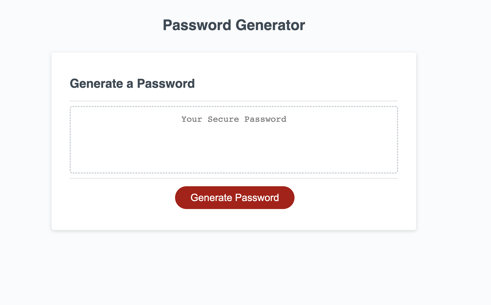

# Password-Generator

## Description

Passwords are crucial for maintaining the privacy and security of personal information, as they act as a barrier against unauthorized acess. When generating a password, it is important to choose a strong and unique combination that is not easily guessable. With that in mind, you can use our website to generate a randomly passaword with the combinations of your choice: Uppercase and Lowercase letters, Numbers and also Special characters.

## Usage

Open the website in your browser. Click the Generate Password button and enter your new Password length. After pick the size of your password we will give you the options to include Uppercase and Lowercase Letters, Numbers and Special Characters. The final result is a ramdom passaword generated just for you. This interaction with the website users was created with Javascript.

## Deployed Site

[Live Demo Link](https://fabioesilveira.github.io/Password-Generator/)